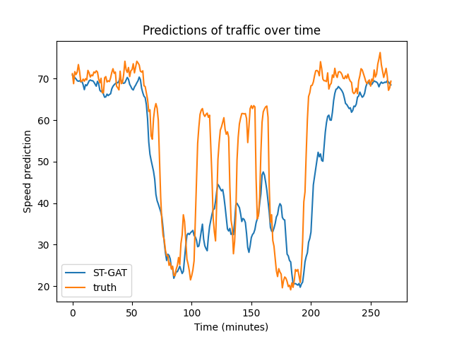

# Traffic Forecasting

## Setup
```
$ git clone https://github.com/akashsonowal/traffic-forecasting.git && cd traffic-forecasting
$ virtualenv --python=python3.8 myenv && source myenv/bin/activate 
$ pip install -r requirements.txt
```
## Usage
```
$ python experiment.py
```
Note: In a single day, we forecast at multiple time stamps (N_SLOTS) and at each time stamp we forecast for a window of 9.
The plot shows the node 0 forecast for the 1st prediction in a single window for all time stamps in a single day.

<p align="center">
  
</p>

## Citation
```
@inproceedings{yu2018spatio,
    title={Spatio-temporal Graph Convolutional Networks: A Deep Learning Framework for Traffic Forecasting},
    author={Yu, Bing and Yin, Haoteng and Zhu, Zhanxing},
    booktitle={Proceedings of the 27th International Joint Conference on Artificial Intelligence (IJCAI)},
    year={2018}
}
```
